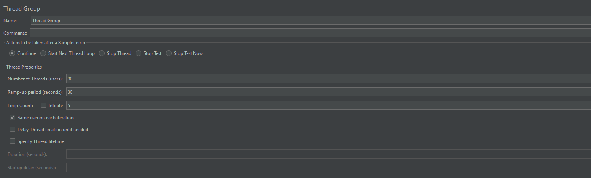
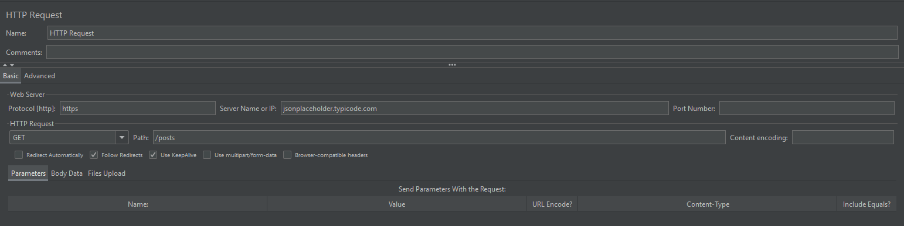
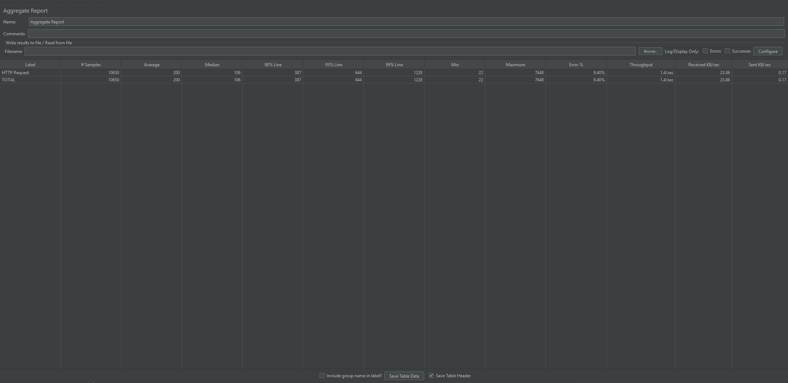
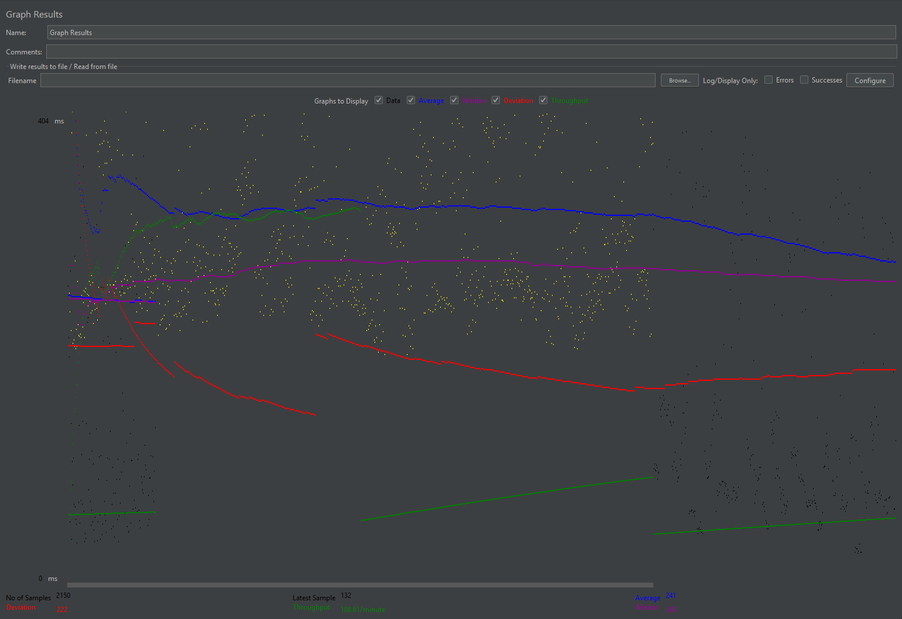

# Performance Testing and Bottleneck Analysis of a REST API Using Apache JMeter

---

## 📌 Target API
https://jsonplaceholder.typicode.com/posts

---

## 🛠 Tool Used
Apache JMeter

---

## 🔄 How It Works

JMeter (client) sends HTTP GET requests to the API server.

JMeter ─────────► jsonplaceholder.typicode.com  
(send request)

JMeter ◄───────── jsonplaceholder.typicode.com  
(receive response)

JMeter records:
- Response time  
- Throughput  
- Error rate  

The results may vary depending on network latency, server load, and request patterns.

---

## 🧪 Test Types

### ✅ Load Test
Simulates normal user traffic to evaluate system performance under expected conditions.

### ✅ Stress Test
Pushes the system beyond its capacity to identify breaking points and performance degradation.

### ✅ Soak Test
Tests system stability over a long period of sustained usage.

---

## 📖 Introduction
Performance testing evaluates how a system behaves under different loads. This study focuses on analyzing the performance of a REST API using Apache JMeter. The objective is to examine system responsiveness, throughput, and reliability under different testing conditions.

---

## ❗ Problem Statement

Modern APIs must handle varying user loads efficiently. This project aims to evaluate how a REST API performs under different traffic conditions, including normal usage and high load, to identify potential bottlenecks and performance limitations.

---

## ⚙️ Test Setup

- Tool: Apache JMeter  
- Protocol: HTTPS  
- Method: GET  
- Loop Count: 10  
- Ramp-Up Period: 50 seconds  
- HTTP Header Manager:  
  - User-Agent: Mozilla/5.0  
  - Accept: application/json  

---

## 🔍 Load Test

The Load Test was conducted to evaluate system performance under normal user conditions using a controlled setup. Only the number of users (threads) is varied across tests to ensure a fair comparison.

### ✅ Configuration
- Number of Users: 10  
- Ramp-Up: 50 seconds  
- Loop Count: 10  
- Timer: None  

### 📊 Results
- Total Requests: 6350  
- Average Response Time: 174 ms  
- Throughput: 1.1 requests/sec  
- Error Rate: **15.75%**  

### 📸 Screenshots

#### Thread Group Setup

#### HTTP Request Configuration

#### Aggregate Report

#### Graph Results

---

### 🧠 Analysis

The Load Test results indicate that the API performs efficiently under normal usage conditions, with an average response time of 174 ms.

However, an error rate of 15.75% was observed, indicating that while most requests were successfully processed, some failures still occurred.

This suggests that the system is generally responsive but exhibits limited reliability when handling repeated requests. These failures may be caused by external factors such as request handling limits or network-related constraints.

---

### ⚠️ Identified Bottleneck

✅ Moderate error rate under normal load indicates a **reliability limitation**

The API may not consistently handle continuous repeated requests, resulting in partial request failures.

---

### ✅ Conclusion (Load Test)

The Load Test demonstrates that the API performs well under normal traffic with fast response times. However, the presence of errors indicates potential reliability issues, suggesting a limitation in handling sustained user activity.

---

## 🔥 Stress Test

The Stress Test was conducted to evaluate system behavior under heavy load conditions by significantly increasing the number of users while keeping all other variables constant.

### ✅ Configuration
- Number of Users: 200  
- Ramp-Up: 50 seconds  
- Loop Count: 10  
- Timer: None  

### 📊 Results
- Total Requests: 8350  
- Average Response Time: 161 ms  
- Throughput: 1.4 requests/sec  
- Error Rate: **11.98%**  

### 📸 Screenshots

#### Thread Group Setup

#### Aggregate Report

#### Graph Results

---

### 🧠 Analysis

Interestingly, the Stress Test resulted in a slightly lower error rate (11.98%) compared to the Load Test (15.75%), despite using a significantly higher number of users.

This behavior suggests that system performance is influenced not only by the number of concurrent users but also by how requests are distributed over time.

With a gradual ramp-up configuration, requests are introduced steadily rather than all at once. This reduces the likelihood of sudden request spikes, allowing the system to process requests more efficiently even under higher load.

This demonstrates that traffic patterns and request distribution play a critical role in system performance.

---

### ⚠️ Identified Bottleneck

✅ Request handling efficiency depends on traffic distribution  

The system may experience more failures during concentrated request bursts rather than sustained distributed traffic.

---

### ✅ Conclusion (Stress Test)

The Stress Test shows that the system remains relatively stable even under heavy load conditions when requests are distributed gradually. This highlights that system limitations are influenced more by traffic patterns than by user count alone.

---

## 📊 Results Summary

| Test | Users | Response Time | Throughput | Error Rate |
|------|------|--------------|------------|-----------|
| Load | 10 | 174 ms | 1.1/sec | 15.75% |
| Stress | 200 | 161 ms | 1.4/sec | 11.98% |
| Soak | - | - | - | - |

---

## 🧠 Overall Analysis

The results show that increasing the number of users does not necessarily lead to worse performance. Instead, system behavior is highly dependent on how requests are distributed.

Gradual load introduction allows the server to manage requests more effectively, while sudden bursts may lead to higher failure rates.

This highlights the importance of considering both user load and traffic patterns in performance testing.

---

## ⏳ Soak Test
(To be completed)

---

## 🎥 Demonstration Video
(Add your YouTube link here)
``
